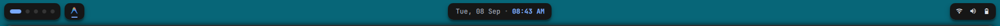
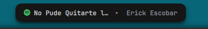
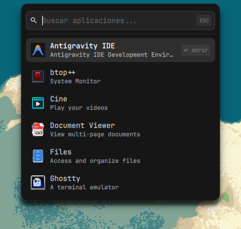
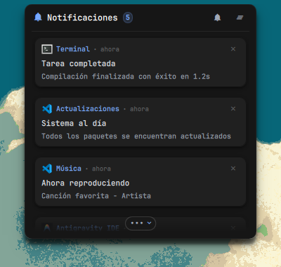
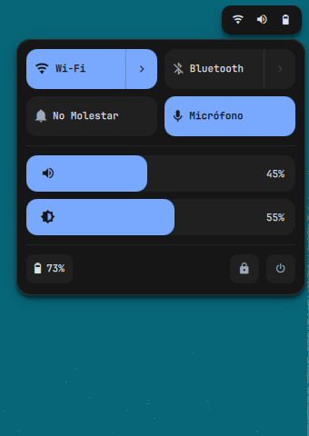
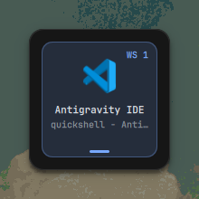
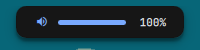
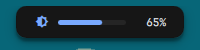
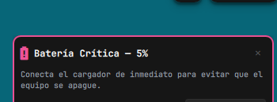

# 🚀 Quickshell Desktop Shell para Hyprland

Entorno de interfaz de usuario moderno, reactivo y estéticamente cuidado diseñado para **Hyprland** (Wayland) utilizando **Quickshell** (Qt6 / QML). Incorpora una barra superior flotante estilo *Dynamic Island*, lanzador de aplicaciones integrado tipo Spotlight, centro de control rápido (Quick Settings), centro de notificaciones desplegable y conmutador de ventanas (*Alt-Tab*) con previsualizaciones en vivo.

---

## 📸 Demostración Visual

### Barra Superior Completa (Top Bar)
Diseño flotante segmentado en cápsulas (*pills*) con efecto *rim-light* y sombras volumétricas por hardware.


---

### Módulos Principales

| Módulo | Captura | Descripción |
| :--- | :---: | :--- |
| **Workspaces & Taskbar** |  | Indicadores de espacios de trabajo estilo GNOME (puntos y cápsula activa alargada) junto a la barra de tareas con indicador inferior y centrado vertical exacto. |
| **Isla Dinámica (Reloj)** |  | Cápsula central en estado de reposo con fecha y hora en jerarquía tipográfica limpia (`Tue, 08 Sep · 08:44 AM`). |
| **Isla Dinámica (Música)** |  | Metamorfosis automática al reproducir audio mediante integración MPRIS: icono de la app, título y artista. |
| **Isla Dinámica (Hover/Controles)** |  | Al pasar el cursor sobre la música, la cápsula se expande fluidamente revelando botones interactivos de pista anterior, play/pausa y siguiente. |
| **Bandeja & Hardware** |  | Iconos de estado de conexión Wi-Fi, nivel de audio, batería y bandeja del sistema (*System Tray* / SNI). Al hacer clic abre el Centro de Control. |

---

### Paneles Desplegables

#### 🔍 Lanzador de Aplicaciones (Spotlight)
Apertura fluida desde la isla central con búsqueda instantánea, navegación por teclado y filtro de ejecutables `.desktop`.
<p align="center">
  
</p>

#### 🔔 Centro de Notificaciones
Historial persistente con acciones interactivas, modo *No Molestar* (DND), botón para limpiar historial, soporte de cerrado con `Esc` e indicador visual `••• 󰅀` cuando hay notificaciones ocultas por scroll.
<p align="center">
  
</p>

#### ⚙️ Centro de Control (Quick Settings)
Acceso rápido a Wi-Fi (con explorador de redes y conexión con clave), Bluetooth (con emparejamiento mediante agente PIN interactivo), sliders de volumen y brillo, selector de perfil de energía y menú de apagado/bloqueo.
<p align="center">
  
</p>

#### 🔀 Conmutador de Ventanas (Alt + Tab)
Selector modal centrado con historial de ventanas MRU (*Most Recently Used*), detección de liberación de `Alt` vía IPC y salto inmediato al espacio de trabajo de la ventana seleccionada.
<p align="center">
  
</p>

---

### 🎛️ Notificaciones en Pantalla (OSD) y Alertas

La barra superior integra directamente en la **Isla Dinámica** los avisos OSD de volumen, brillo y estado del micrófono, optimizando el espacio visual sin necesidad de ventanas emergentes invasivas. Para emergencias de energía, cuenta con una alerta flotante de batería crítica.

| OSD / Alerta | Captura | Descripción |
| :--- | :---: | :--- |
| **OSD Volumen** |  | Metamorfosis instantánea de la isla central al pulsar teclas de volumen, mostrando icono, barra de progreso y porcentaje. |
| **OSD Brillo** |  | Indicador visual de brillo de pantalla con barra animada reactiva a teclas de brillo. |
| **OSD Micrófono** |  | Aviso en color crítico al silenciar o activar el micrófono mediante atajos de hardware. |
| **Alerta Batería Crítica** |  | Tarjeta flotante en esquina superior derecha con borde pulsante rosa, aviso sonoro y advertencia inmediata. |

---

## 📦 Instalación desde Cero en Fedora

### 1. Habilitar Copr e Instalar Quickshell
En **Fedora Linux**, Quickshell se encuentra empaquetado en el repositorio Copr de `lionheartp`:

```bash
# Habilitar repositorio Copr de Quickshell
sudo dnf copr enable lionheartp/quickshell -y

# Instalar Quickshell
sudo dnf install quickshell -y
```

*(Opcional) Si prefieres compilar Quickshell manualmente desde el código fuente, consulta el repositorio oficial en [git.outfoxxed.me/outfoxxed/quickshell](https://git.outfoxxed.me/outfoxxed/quickshell).*

---

### 2. Paquetes y Dependencias del Sistema

Para que cada función de este entorno opere al 100% (sonidos, control de hardware, Bluetooth, brillo, etc.), instala los siguientes paquetes divididos por subsistema:

```bash
sudo dnf install -y \
    sound-theme-freedesktop \
    libcanberra-gtk3 \
    pulseaudio-utils \
    pipewire \
    wireplumber \
    brightnessctl \
    playerctl \
    NetworkManager \
    bluez \
    python3-dbus \
    python3-gobject \
    hyprland \
    hyprlock \
    grim \
    slurp
```

#### 📋 Detalle de para qué sirve cada dependencia:

| Paquete / Utilidad | Función en la Shell |
| :--- | :--- |
| **`sound-theme-freedesktop`** | Proporciona los archivos de audio oficiales (`/usr/share/sounds/freedesktop/stereo/*.oga`) utilizados para las alertas de nuevas notificaciones (`message-new-instant.oga`), advertencia de batería (`dialog-warning.oga`) y alarma crítica de descarga (`dialog-error.oga`). |
| **`libcanberra-gtk3`** | Proporciona el comando `canberra-gtk-play`, que reproduce los sonidos de eventos y notificaciones con latencia ultrabaja sin bloquear la interfaz. |
| **`pulseaudio-utils`** | Proporciona la utilidad `paplay` utilizada como respaldo directo para reproducción de archivos de audio de sistema y alertas sonoras de batería crítica. |
| **`pipewire` & `wireplumber`** | Proporcionan el CLI `wpctl` utilizado por `AudioService.qml` para consultar y modificar el volumen del sistema, silenciar parlantes (`@DEFAULT_AUDIO_SINK@`) y alternar el micrófono (`@DEFAULT_AUDIO_SOURCE@`). |
| **`brightnessctl`** | Gestiona el nivel de brillo de la pantalla (`BrightnessService.qml`). Lee valores del backlight y los ajusta fluidamente desde el slider del Centro de Control o atajos de teclado. |
| **`playerctl`** | Utilizado junto a la integración MPRIS de Quickshell (`MediaService.qml`) para pausar, reproducir y cambiar pistas de Spotify, reproductores locales o navegadores web. |
| **`NetworkManager`** | Proporciona `nmcli`, utilizado por `NetworkService.qml` y `ControlCenterService.qml` para detectar redes Wi-Fi disponibles, conectarse mediante contraseña e informar la intensidad de la señal y estado de red cableada. |
| **`bluez`** | Proporciona el demonio Bluetooth y la herramienta `bluetoothctl` para encendido/apagado, detección de dispositivos vinculados y nivel de batería de periféricos. |
| **`python3-dbus` & `python3-gobject`** | Requeridos por el agente Bluetooth en segundo plano (`services/bt_agent.py`) para gestionar la autorización y el intercambio de códigos PIN de emparejamiento mediante D-Bus. |
| **`hyprland` & `hyprctl`** | Servidor gráfico y herramienta IPC para alternar workspaces, enfocar ventanas, consultar estado de teclas y registrar eventos de apertura/cierre de aplicaciones. |
| **`hyprlock`** | Bloqueador de pantalla invocado desde el botón de bloqueo en la tarjeta de energía del Centro de Control. |
| **`grim` & `slurp`** | Utilidades de captura de pantalla bajo Wayland. |

---

### 3. Tipografía e Iconos

La interfaz hace uso de la fuente **JetBrainsMono Nerd Font Propo** para garantizar que tanto el texto tipográfico como todos los glifos e iconos vectoriales (volumen, batería, chevrons, wifi, etc.) se rendericen sin fallas.

#### Descarga e instalación de la fuente:
```bash
# Crear directorio de fuentes del usuario
mkdir -p ~/.local/share/fonts

# Descargar e instalar JetBrainsMono Nerd Font
cd /tmp
curl -LO https://github.com/ryanoasis/nerd-fonts/releases/latest/download/JetBrainsMono.tar.xz
tar -xf JetBrainsMono.tar.xz -C ~/.local/share/fonts/
fc-cache -fv
```

#### Iconos de aplicaciones:
Para los iconos del lanzador de aplicaciones y conmutador de ventanas, se recomienda un tema moderno como **MoreWaita** o **Papirus**:
```bash
# Instalar Papirus
sudo dnf install papirus-icon-theme -y
```

---

### 4. Permisos de Usuario (Control de Brillo)

Para que `brightnessctl` pueda modificar el brillo sin necesidad de `sudo`:
```bash
sudo usermod -aG video $USER
sudo usermod -aG input $USER
```
*(Nota: Reinicia sesión para que los cambios de grupo surtan efecto).*

---

## 🔧 Instalación de esta Configuración

1. Clona o ubica este repositorio en tu directorio de configuración:
   ```bash
   # Asegúrate de que apunte a ~/.config/quickshell
   mkdir -p ~/.config
   git clone <URL_DE_TU_REPOSITORIO> ~/.config/quickshell
   ```

2. Para probar que Quickshell arranque correctamente:
   ```bash
   quickshell
   ```

---

## ⌨️ Integración con Hyprland (`hyprland.conf`)

Agrega las siguientes líneas a tu archivo `~/.config/hypr/hyprland.conf`:

### Autoinicio
```ini
# Iniciar Quickshell al arrancar Hyprland
exec-once = quickshell
```

### Atajos de Teclado Recomendados
```ini
# Lanzador de aplicaciones (Super + Espacio)
bind = SUPER, SPACE, exec, quickshell ipc call launcher toggle

# Centro de Control (Super + C)
bind = SUPER, C, exec, quickshell ipc call controlcenter toggle

# Centro de Notificaciones (Super + N)
bind = SUPER, N, exec, quickshell ipc call notifications toggle

# Conmutador de Ventanas Alt+Tab
bind = ALT, TAB, exec, quickshell ipc call switcher next
bind = ALT SHIFT, TAB, exec, quickshell ipc call switcher prev

# Teclas de Hardware: Volumen (PipeWire)
bind = , XF86AudioRaiseVolume, exec, quickshell ipc call audio raise
bind = , XF86AudioLowerVolume, exec, quickshell ipc call audio lower
bind = , XF86AudioMute, exec, quickshell ipc call audio mute
bind = , XF86AudioMicMute, exec, quickshell ipc call audio micMute

# Teclas de Hardware: Brillo de Pantalla
bind = , XF86MonBrightnessUp, exec, quickshell ipc call brightness raise
bind = , XF86MonBrightnessDown, exec, quickshell ipc call brightness lower
```

---

## 🗂️ Estructura del Proyecto

```text
~/.config/quickshell/
├── assets/                  # Iconos SVG y capturas de pantalla de la interfaz
│   ├── icons/               # Iconos corregidos compatibles con QtSvg (btop, htop, etc.)
│   └── screenshots/         # Imágenes de muestra para documentación
├── components/              # Componentes reutilizables QML (Pill, etc.)
├── modules/                 # Módulos de la interfaz de usuario
│   ├── bar/                 # Lienzo principal y layout horizontal de la barra
│   ├── center/              # Isla dinámica (Reloj, Media, Lanzador, Notificaciones)
│   ├── controlcenter/       # Centro de Control rápido y submenús (Wi-Fi, Bluetooth)
│   ├── hardware/            # Indicadores de estado de hardware (Batería, Red, Audio)
│   ├── launcher/            # Vistas del lanzador de aplicaciones
│   ├── osd/                 # Alertas de batería crítica y OSD en pantalla
│   ├── switcher/            # Conmutador modal de ventanas Alt+Tab
│   ├── taskbar/             # Barra de tareas de ventanas abiertas por workspace
│   ├── tray/                # Bandeja del sistema (StatusNotifierItem)
│   └── workspaces/          # Puntos e indicadores de áreas de trabajo de Hyprland
├── services/                # Servicios singleton reactivos y conectores de backend
│   ├── AudioService.qml     # Control de volumen y micrófonos con Pipewire/wpctl
│   ├── BatteryService.qml   # Lectura de /sys/class/power_supply/ y alertas
│   ├── BluetoothService.qml # Detección rápida de periféricos vía bluetoothctl
│   ├── BrightnessService.qml# Control de brillo de monitor con brightnessctl
│   ├── ControlCenterService.qml # Lógica de Wi-Fi, perfiles de energía y power menu
│   ├── LauncherService.qml  # Indexación de archivos .desktop y filtrado
│   ├── MediaService.qml     # Integración MPRIS y metadatos de reproducción
│   ├── NetworkService.qml   # Estado de interfaz de red con nmcli
│   ├── NotificationService.qml # Servidor de notificaciones Freedesktop D-Bus
│   ├── SwitcherService.qml  # Manejo de foco MRU y polling de teclado Hyprland
│   └── bt_agent.py          # Agente D-Bus en Python para emparejamiento Bluetooth
├── theme/
│   └── Theme.qml            # Paleta de colores, métricas de píldoras, fuentes y sombras
├── shell.qml                # Punto de entrada principal y registro de controladores IPC
└── README.md                # Documentación del proyecto
```

---

## 🛠️ Solución de Problemas Frecuentes

1. **Las notificaciones no emiten sonido**:
   - Comprueba tener instalado `sound-theme-freedesktop` y `libcanberra-gtk3` o `pulseaudio-utils`.
   - Puedes probar manualmente la reproducción con:
     ```bash
     canberra-gtk-play -i message-new-instant || paplay /usr/share/sounds/freedesktop/stereo/message-new-instant.oga
     ```

2. **Los iconos aparecen como cuadrados o caracteres extraños**:
   - Asegúrate de haber instalado y actualizado la caché de fuentes con `JetBrainsMono Nerd Font Propo`.

3. **No se puede modificar el brillo desde el slider**:
   - Revisa que tu usuario pertenezca al grupo `video`:
     ```bash
     groups $USER
     ```
   - Si no aparece `video`, agrégalo con `sudo usermod -aG video $USER` y vuelve a iniciar sesión.

4. **El emparejamiento Bluetooth falla al solicitar código PIN**:
   - Asegúrate de tener instalados `python3-dbus` y `python3-gobject`. Puedes probar ejecutar el agente directamente para verificar que no falte ningún módulo:
     ```bash
     python3 ~/.config/quickshell/services/bt_agent.py
     ```
