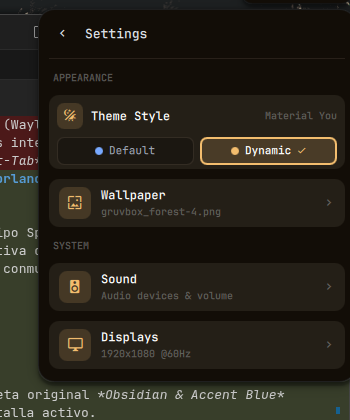

# 🚀 Quickshell Desktop Shell para Hyprland

Entorno de escritorio y shell de usuario moderno, reactivo y de alto rendimiento diseñado para **Hyprland** (Wayland) utilizando **Quickshell** (Qt6 / QML). 

Incorpora una barra superior flotante estilo *Dynamic Island*, lanzador de aplicaciones integrado tipo Spotlight, centro de control rápido con submenús avanzados, sistema de temas dual con soporte de **Matugen (Material You)**, gestión nativa de fondos de pantalla con disolución cinematográfica, centro de notificaciones, gestor de portapapeles, agente de autenticación Polkit y conmutador de ventanas (*Alt-Tab*) con previsualizaciones en vivo.

---

## ✨ Características Destacadas

- 🎨 **Sistema Dual de Temas (Default vs Material You)**: Alterna al instante entre la elegante paleta original *Obsidian & Accent Blue* (`#78a9ff`) y el modo dinámico generado automáticamente por **Matugen** a partir de tu fondo de pantalla activo.
- 🏝️ **Isla Dinámica Central (Dynamic Island)**: Metamorfosis fluida entre reloj tipográfico, controles multimedia (MPRIS), notificaciones OSD integradas (volumen/brillo/micrófono), lanzador Spotlight, historial de portapapeles y avisos de batería.
- 🖼️ **Gestión de Fondos de Pantalla con Doble Buffer**: Transiciones suaves sin saltos de luz ni parpadeos (*zero white flash*), con galería visual en el Centro de Control y soporte multimonitor.
- 🎛️ **Centro de Control Integral**: Toggles de Wi-Fi y Bluetooth con emparejamiento por PIN, sliders contextuales por pantalla, selector de perfiles de energía (Eco, Balance, Turbo), y submenús de configuración (Audio, Displays, Wallpapers y Theme Style).
- ⌨️ **Navegación Total por Teclado**: Cada panel, submenú y diálogo cuenta con navegación por flechas (`←` / `→` / `↑` / `↓`), `Tab`, `Espacio`, `Enter` y `Esc`.
- ⚡ **Rendimiento Óptimo**: 0.0% de consumo de CPU adicional en reposo, bindings de QML puros y llamadas asíncronas no bloqueantes.

---

## 📸 Demostración Visual

### Barra Superior Completa (Top Bar)
Diseño flotante segmentado en cápsulas (*pills*) con efecto *rim-light*, bordes suaves traslúcidos y sombras volumétricas por hardware.


---

### Módulos Principales

| Módulo | Captura | Descripción |
| :--- | :---: | :--- |
| **Workspaces & Taskbar** |  | Indicadores estilo GNOME (puntos inactivos y píldora activa alargada) totalmente sincronizados con Hyprland. Soportan colores dinámicos de Matugen (acento activo y color terciario armónico para espacios ocupados). |
| **Isla Dinámica (Reloj)** |  | Cápsula central en estado de reposo con fecha y hora en jerarquía tipográfica limpia (`Tue, 08 Sep · 08:44 AM`). |
| **Isla Dinámica (Música)** |  | Metamorfosis automática al reproducir audio mediante integración MPRIS: icono de la app, título y artista. |
| **Isla Dinámica (Hover/Controles)** |  | Al pasar el cursor sobre la música, la cápsula se expande fluidamente revelando botones interactivos de pista anterior, play/pausa y siguiente. |
| **Bandeja & Hardware** |  | Iconos de estado de conexión Wi-Fi, nivel de audio, batería y bandeja del sistema (*System Tray* / SNI). Al hacer clic abre el Centro de Control. |

---

### Paneles y Diálogos

#### 🔍 Lanzador de Aplicaciones (Spotlight)
Apertura fluida desde la isla central con búsqueda instantánea, calculadora matemática integrada, ejecución directa de comandos de terminal, búsqueda web rápida y navegación por teclado.
<p align="center">
  
</p>

#### 🎛️ Centro de Control y Submenú de Ajustes (Settings)
Panel de control desplegable con accesos directos (Wi-Fi, Bluetooth, Micrófono, Desvelo/Caffeine, Selector de Color y Captura de Pantalla), sliders interactivos de brillo y volumen, selector de perfiles energéticos y panel de configuración (**Theme Style** con selección Default vs Matugen Dinámico, Wallpapers, Sonido y Displays).

<p align="center">
  
  &nbsp;&nbsp;&nbsp;&nbsp;
  
</p>

#### 🔔 Centro de Notificaciones
Historial persistente con acciones interactivas, modo *No Molestar* (DND), botón para limpiar historial, soporte de cerrado con `Esc` e indicador visual cuando hay notificaciones ocultas por scroll.
<p align="center">
  
</p>

#### 🔀 Conmutador de Ventanas (Alt + Tab)
Selector modal centrado con historial de ventanas MRU (*Most Recently Used*), detección de liberación de `Alt` vía IPC y salto inmediato al espacio de trabajo de la ventana seleccionada.
<p align="center">
  
</p>

---

### 🎛️ Notificaciones en Pantalla (OSD) y Alertas

La barra superior integra directamente en la **Isla Dinámica** los avisos OSD de volumen, brillo y estado del micrófono, optimizando el espacio visual sin ventanas invasivas.

| OSD / Alerta | Captura | Descripción |
| :--- | :---: | :--- |
| **OSD Volumen** |  | Metamorfosis instantánea de la isla central al pulsar teclas de volumen, mostrando icono, barra de progreso y porcentaje. |
| **OSD Brillo** |  | Indicador visual de brillo de pantalla con barra animada reactiva a teclas de brillo. |
| **OSD Micrófono** |  | Aviso en color crítico al silenciar o activar el micrófono mediante atajos de hardware. |
| **Alerta Batería Crítica** |  | Tarjeta flotante en esquina superior derecha con borde pulsante rosa, aviso sonoro y advertencia inmediata. |

---

## 🎨 Sistema de Tematización Dual (Matugen & Default)

El proyecto cuenta con un sistema centralizado de diseño en [`theme/Theme.qml`](theme/Theme.qml) que elimina cualquier color hexadecimal fijo y soporta dos modalidades instantáneas:

1. **Modo Default (`"default"`):**
   - Preserva la paleta oscura original basada en Waybar: acento azul `#78a9ff`, fondos oscuros `#161616` / `#121212` y verde esmeralda `#42be65` para workspaces activos con programas.
2. **Modo Dinámico (`"matugen"`):**
   - Extrae automáticamente la paleta Material You del fondo de pantalla actual usando el CLI nativo `matugen`.
   - El acento principal (`highlight`), tarjetas, fondos, bordes y el color terciario de los workspaces ocupados se armonizan en tiempo real.
   - El estado se persiste en `~/.config/quickshell/state/theme_mode.txt` y se almacena en caché en `~/.config/quickshell/state/dynamic_theme.json`.

---

## 📦 Requisitos e Instalación en Fedora

### 1. Habilitar Copr para Quickshell, Matugen y Herramientas Hyprland
En Fedora, el repositorio de la comunidad **lionheartp/Hyprland** provee `quickshell`, `matugen`, `hyprpicker`, `hyprshot` y las herramientas esenciales del ecosistema:
```bash
sudo dnf copr enable lionheartp/Hyprland -y
```

### 2. Paquetes y Dependencias del Sistema
Instala todos los paquetes requeridos con un solo comando:
```bash
sudo dnf install -y \
    quickshell \
    matugen \
    hyprpicker \
    hyprshot \
    power-profiles-daemon \
    sound-theme-freedesktop \
    libcanberra-gtk3 \
    pulseaudio-utils \
    pipewire \
    wireplumber \
    brightnessctl \
    playerctl \
    NetworkManager \
    bluez \
    python3-dbus \
    python3-gobject \
    hyprland \
    hyprlock \
    hypridle \
    grim \
    slurp \
    jq \
    wl-clipboard
```

#### 📋 Resumen de utilidades clave:
- **`quickshell`**: Motor reactivo Qt6/QML para la capa de interfaz de usuario en Wayland.
- **`matugen`**: Extractor dinámico de paletas Material You a partir de fondos de pantalla.
- **`jq`**: Procesamiento de alto rendimiento del árbol JSON del tema dinámico.
- **`wl-clipboard`**: Soporte del demonio de portapapeles (`wl-paste`, `wl-copy`).
- **`hyprpicker` & `hyprshot`**: Selector de color gotero y capturas de región desde el Centro de Control.
- **`power-profiles-daemon`**: Control y conmutación de perfiles energéticos (Eco, Balance, Turbo).
- **`pipewire` & `wireplumber` (`wpctl`)**: Gestión reactiva de sonido, micrófonos y cambio de sinks.
- **`brightnessctl`**: Regulación de brillo multimonitor.
- **`NetworkManager` (`nmcli`) & `bluez` (`bluetoothctl`)**: Gestión de redes y dispositivos Bluetooth.

### 3. Tipografía e Iconos
Instala **JetBrainsMono Nerd Font Propo** para garantizar la correcta visualización de todos los iconos:
```bash
mkdir -p ~/.local/share/fonts
cd /tmp
curl -LO https://github.com/ryanoasis/nerd-fonts/releases/latest/download/JetBrainsMono.tar.xz
tar -xf JetBrainsMono.tar.xz -C ~/.local/share/fonts/
fc-cache -fv
```

---

## ⌨️ Integración con Hyprland (`hyprland.conf`)

Agrega lo siguiente a tu archivo `~/.config/hypr/hyprland.conf`:

### Autoinicio
```ini
# Iniciar Quickshell al arrancar Hyprland
exec-once = quickshell
```

### Atajos de Teclado Recomendados
```ini
# Lanzador Spotlight (Super + Espacio)
bind = SUPER, SPACE, exec, quickshell ipc call launcher toggle

# Centro de Control (Super + C)
bind = SUPER, C, exec, quickshell ipc call controlcenter toggle

# Centro de Notificaciones (Super + N)
bind = SUPER, N, exec, quickshell ipc call notifications toggle

# Portapapeles (Super + V)
bind = SUPER, V, exec, quickshell ipc call clipboard toggle

# Conmutador de Ventanas Alt + Tab
bind = ALT, TAB, exec, quickshell ipc call switcher next
bind = ALT SHIFT, TAB, exec, quickshell ipc call switcher prev

# Alternar Tema entre Por Defecto y Matugen Dinámico
bind = SUPER SHIFT, T, exec, quickshell ipc call theme toggle

# Cambiar de Fondo de Pantalla (Siguiente / Anterior)
bind = SUPER SHIFT, W, exec, quickshell ipc call wallpaper next
bind = SUPER CTRL, W, exec, quickshell ipc call wallpaper prev

# Teclas Multimedia y Hardware
bind = , XF86AudioRaiseVolume, exec, quickshell ipc call audio raise
bind = , XF86AudioLowerVolume, exec, quickshell ipc call audio lower
bind = , XF86AudioMute, exec, quickshell ipc call audio mute
bind = , XF86AudioMicMute, exec, quickshell ipc call audio micMute
bind = , XF86MonBrightnessUp, exec, quickshell ipc call brightness raise
bind = , XF86MonBrightnessDown, exec, quickshell ipc call brightness lower
```

---

## 📡 Control por Terminal / IPC

Quickshell expone una API completa por IPC accesible mediante `quickshell ipc call <target> <método>`:

| Objetivo (`target`) | Métodos disponibles | Descripción |
| :--- | :--- | :--- |
| `theme` | `setMode("default" \| "matugen")`, `toggle()` | Cambia o alterna el modo de tema entre fijo y dinámico. |
| `wallpaper` | `next()`, `prev()`, `set(path)`, `scan()` | Navega o asigna un fondo de pantalla con animación suave. |
| `controlcenter` | `toggle()`, `open()`, `close()`, `openSettings()`, `openAudio()`, `openWallpaper()`, `openDisplays()` | Controla la apertura del Centro de Control o submenús específicos. |
| `launcher` | `toggle()`, `open()`, `close()`, `next()`, `prev()`, `launch()` | Controla el lanzador Spotlight. |
| `clipboard` | `toggle()`, `open()`, `close()`, `clear()` | Gestiona el historial de portapapeles. |
| `notifications` | `toggle()`, `open()`, `close()`, `clear()`, `dnd()`, `expand()` | Controla el centro de notificaciones y modo no molestar. |
| `audio` | `raise()`, `lower()`, `mute()`, `micMute()` | Regula volumen y mute de audio/micrófono. |
| `brightness` | `raise()`, `lower()` | Regula el nivel de brillo de pantalla. |
| `power` | `set(profile)`, `cycle()`, `save()`, `balanced()`, `performance()` | Conmuta perfiles energéticos del sistema. |
| `switcher` | `next()`, `prev()`, `open()`, `close()`, `select()`, `cancel()` | Controla el selector modal de ventanas Alt+Tab. |
| `session` | `toggle()`, `open()`, `close()`, `lock()`, `suspend()`, `logout()`, `reboot()`, `shutdown()` | Acciones de energía y sesión. |

---

## 🗂️ Estructura del Proyecto

```text
~/.config/quickshell/
├── assets/                  # Capturas de pantalla e iconos vectoriales
├── components/              # Componentes base reutilizables (Pill, BarButton, TrayMenu)
├── modules/                 # Vistas y capas visuales de la interfaz
│   ├── bar/                 # Lienzo y píldoras horizontales de la barra superior
│   ├── center/              # Isla dinámica (Reloj, Media, Notificaciones, Portapapeles, Polkit)
│   ├── controlcenter/       # Centro de Control, Ajustes, Wallpapers, Audio y Displays
│   ├── hardware/            # Indicadores de estado de hardware (Batería, Red, Audio)
│   ├── launcher/            # Botón del lanzador de aplicaciones
│   ├── lock/                # Ventana y superficie de bloqueo de pantalla
│   ├── osd/                 # Alertas de batería crítica y OSD de volumen/brillo
│   ├── session/             # Ventana modal de energía y fin de sesión
│   ├── switcher/            # Conmutador modal de ventanas Alt+Tab
│   ├── taskbar/             # Barra de tareas agrupada por espacio de trabajo
│   ├── tray/                # Bandeja del sistema (StatusNotifierItem)
│   ├── wallpaper/           # Lienzo nativo Wayland para fondo de pantalla con cross-dissolve
│   └── workspaces/          # Puntos interactivos y sincronización de workspaces
├── services/                # Servicios singleton reactivos y conectores de sistema
│   ├── AudioService.qml     # Control de sinks/sources mediante wpctl
│   ├── BatteryService.qml   # Monitoreo de batería y alertas de descarga
│   ├── BluetoothService.qml # Detección bluetoothctl y agente PIN
│   ├── BrightnessService.qml# Control multimonitor con brightnessctl
│   ├── ClipboardService.qml # Demonio y registro de portapapeles
│   ├── ControlCenterService.qml # Estado global del panel de control
│   ├── DisplayService.qml   # Detección y ajustes de resolución/Hz con hyprctl
│   ├── LauncherService.qml  # Indexación de .desktop, matemáticas y web
│   ├── LockService.qml      # Lógica de bloqueo de pantalla y pam
│   ├── MediaService.qml     # Cliente MPRIS de reproducción multimedia
│   ├── NetworkService.qml   # Detección de redes y Wi-Fi mediante nmcli
│   ├── NotificationService.qml # Servidor D-Bus de notificaciones freedesktop
│   ├── PolkitService.qml    # Agente de autorización Polkit integrado
│   ├── PowerProfileService.qml # Perfiles power-profiles-daemon
│   ├── SessionService.qml   # Control logind de suspensión, reinicio y apagado
│   ├── SwitcherService.qml  # Historial MRU y navegación de ventanas
│   └── WallpaperService.qml # Servicio de escaneo, persistencia y extracción con Matugen
├── state/                   # Estado persistente del usuario (wallpaper.txt, theme_mode.txt, etc.)
├── theme/
│   └── Theme.qml            # Tokens semánticos globales, paletas fijas y dinámicas
├── shell.qml                # Punto de entrada principal y registro de controladores IPC
└── README.md                # Documentación técnica completa
```

---

## 🛠️ Solución de Problemas Frecuentes

1. **Las notificaciones no emiten sonido**:
   - Comprueba tener instalados `sound-theme-freedesktop` y `libcanberra-gtk3` o `pulseaudio-utils`.
   - Puedes probar manualmente la reproducción con:
     ```bash
     canberra-gtk-play -i message-new-instant || paplay /usr/share/sounds/freedesktop/stereo/message-new-instant.oga
     ```

2. **Los iconos aparecen como cuadrados o caracteres extraños**:
   - Asegúrate de haber instalado y actualizado la caché de fuentes con `JetBrainsMono Nerd Font Propo`:
     ```bash
     fc-cache -fv
     ```

3. **No se puede modificar el brillo desde el slider**:
   - Revisa que tu usuario pertenezca al grupo `video`:
     ```bash
     sudo usermod -aG video $USER
     ```
   - Reinicia la sesión para que el cambio de grupo surta efecto.

4. **Matugen no extrae colores al cambiar de fondo**:
   - Verifica que el binario de Matugen esté en `/usr/bin/matugen` o accesible en tu `$PATH`:
     ```bash
     matugen --version
     ```
   - Comprueba que `jq` esté instalado para el procesamiento del JSON:
     ```bash
     sudo dnf install jq -y
     ```
